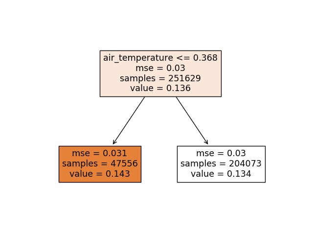

# DTREE REGRESSION
---
## file config
[dtree_regression.yaml](../Config/dtree_regression.yaml)

## header functions

~~~
def DecisionTree(file_analysis,artifact_uri,experiment_id, run_id, input_dir,model_input,model_output,n_rows, 
max_depth, criterion, splitter,min_samples_split, min_samples_leaf, min_weight_fraction_leaf,max_features, random_state,
max_leaf_nodes, figure, n_splits)
~~~
## parameters
*   **file_analysis:** File analyse. This param is generate from [main.py](../main.py)
*   **artifact_uri:** URL artifact mlflow. This param is generate from [main.py](../main.py)
*   **experiment_id:** Experiment id mlflow. This params is generate from [main.py](../main.py)
*   **run_id:** Run id mlflow. This param is generate from [main.py](../main.py)
*   **input_dir:** [ (string) name_directory ] Directory get Data.
*   **n_rows:** [ (int) ] Numbers rows DataSet. This params get from [main.yaml](main.yaml)
*   **model_input:** [ (list string) fields ] Fields input for run algorithms.
*   **model_output:** [ (list string) fields ] Fields output for run algorithms.
*   **n_splits:**  [ (int) ] Number trees
*   **max_depth:** [ (string) ] Params algorithms DecisionTreeRegressor
*   **criterion:** [ (string) ] Params algorithms DecisionTreeRegressor
*   **max_depth:** [ (string) ] Params algorithms DecisionTreeRegressor
*   **splitter:** [ (string) ] Params algorithms DecisionTreeRegressor
*   **min_samples_split:** [ (string) ] Params algorithms DecisionTreeRegressor
*   **min_samples_leaf:** [ (string) ] Params algorithms DecisionTreeRegressor
*   **min_weight_fraction_leaf:** [ (string) ] Params algorithms DecisionTreeRegressor
*   **max_features:** [ (string) ] Params algorithms DecisionTreeRegressor
*   **random_state:** [ (string) ] Params algorithms DecisionTreeRegressor
*   **max_leaf_nodes:** [ (string) ] Params algorithms DecisionTreeRegressor
*   **figure:** [ (string) ] Params algorithms DecisionTreeRegressor

## explain use

* Config.yaml

~~~
    main.yaml
        etl:      ""
        deepl:    ""
        mlearn:   dtree_regression
        n_rows:   0.0
        elements: ""
        output_dir: Data/test_icpe_v2

    dtree_regression.yaml
        model_input:                air_temperature,cloud_coverage,dew_temperature,precip_depth_1_hr,sea_level_pressure,wind_speed,meter_reading
        model_output:               meter_reading 
        input_dir:                  Data/test_icpe_v2
        max_depth:                  1
        criterion:                  mse
        splitter:                   best
        min_samples_split:          2
        min_samples_leaf:           1
        min_weight_fraction_leaf:   0.0
        max_features:               auto
        max_leaf_nodes:             2
        random_state:               0
        figure:                     False
        n_splits:                   5

~~~
This algorithms perfoms through a numbers of Kfold a series  of models using DECISION TREE Regressor algorithms. It goes developing predictions and storing each one of the results in the array called **scores**.
**n_splits** will indicate us the number of times that the recived dataset will be split.  Finally, the metrics than  will be calculated are:

- Scores list every Kfold.
- mean
- Tipic desviations

Finally each model generated will be stored in mlflow.

### Return

Save image png:

`[input_dir]/decision_tree_regression/[image.png]`

The metrics store are:
- Scores list every Kfold.
- mean
- Tipic desviations
~~~
    for idx in range(len(scores)):
            mlflow.log_metric("scores",scores[idx], step=idx+1 )
    mlflow.log_metric("mean", np.mean(scores))
    mlflow.log_metric("std", np.std(scores))
~~~
Store models:
`mlflow.sklearn.log_model(sk_model=dtree_model,signature=signature,artifact_path=input_dir+"/dtree_regressor" )`

[ insert img mlflow ]

