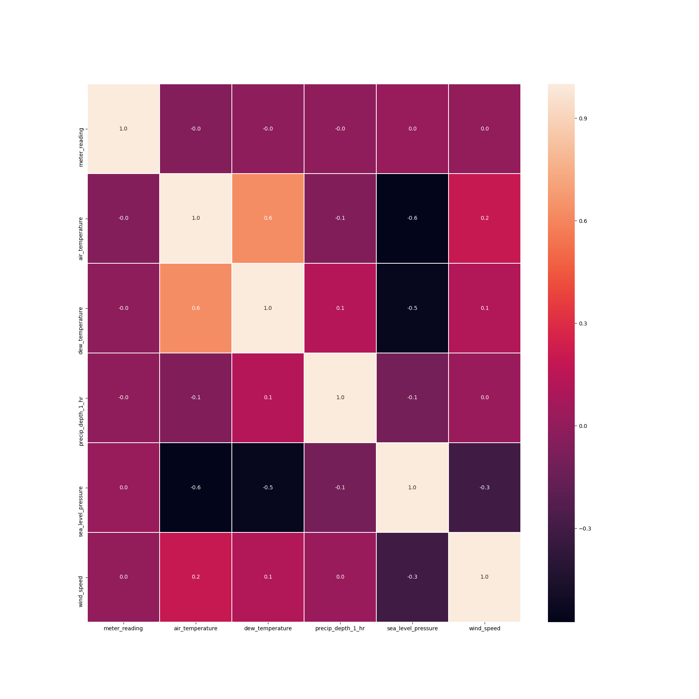

# FEATURE SELECTION
---
## file config
[feature-selection.yaml](../Config/feature-selection.yaml)

## header functions

~~~
def feature_selection( n_rows,fields_include,input_dir, elements,alg_fs)
~~~
## parameters
*   **n_rows:**         [ (int) ] Numbers rows DataSet. This params get from [main.yaml](main.yaml)
*   **elements:**       [ (string) name_elements ] Filter by elements. This params get from [main.yaml](main.yaml)
*   **fields_include:** [ (list string) name field DataSet ] Filter by DataSet fields.
*   **input_dir:**      [ (string) name directory ] Input directory to get data.
*   **alg_fs:**    [ (string) name_algorithms] Name Algorithms missing values. [FSMeasure, coorelation]

## explain use 
*   Config.yaml 

    ~~~
    main.yaml
        etl:      feature-selection
        deepl:    ""
        mlearn:   ""
        n_rows:   0.0
        elements: ""
        output_dir: Data/test_icpe_v2

    feature-selection.yaml
        fields_include: meter_reading,air_temperature,dew_temperature,precip_depth_1_hr,sea_level_pressure,wind_speed
        input_dir: Data/test_icpe_v2
        alg_fs: FSMeasures
    ~~~

It is important in this step, the fields_include parameter, because , some fields are not interesting to make, for example, an entropy calculation or to see the relation between them. Through the parameter, the algorithms will take the csv files to apply feature selections techniques.The selected algorithm will be indicated in the alg_fs parameters. Currently only FSMeasures and correlation are implemented.

- FSMeasures:
~~~
   FSMeasures show calculation. 
   *    mean. Mean.
   *    std. Desviation tipic
   *    variance
   *    entropy
   *    chi
   *    dispersion
~~~

- Correlation
~~~
    Show the correlations between fields.
~~~

### CORRELATION 

### FSMASURES
<table border="1" class="dataframe">
  <thead>
    <tr style="text-align: right;">
      <th></th>
      <th>mean</th>
      <th>Std.Dev</th>
      <th>Var</th>
      <th>entropy</th>
      <th>chi</th>
      <th>dispersion</th>
    </tr>
  </thead>
  <tbody>
    <tr>
      <th>meter_reading</th>
      <td>226.254001</td>
      <td>376.548705</td>
      <td>141788.927366</td>
      <td>6.445614</td>
      <td>5.677824e+08</td>
      <td>89.447439</td>
    </tr>
    <tr>
      <th>air_temperature</th>
      <td>22.864378</td>
      <td>6.009380</td>
      <td>36.112648</td>
      <td>3.769795</td>
      <td>1.430987e+06</td>
      <td>1.120325</td>
    </tr>
    <tr>
      <th>dew_temperature</th>
      <td>16.858351</td>
      <td>6.482163</td>
      <td>42.018435</td>
      <td>3.645617</td>
      <td>2.258191e+06</td>
      <td>1.813055</td>
    </tr>
    <tr>
      <th>precip_depth_1_hr</th>
      <td>1.385327</td>
      <td>12.971028</td>
      <td>168.247563</td>
      <td>0.526576</td>
      <td>1.100354e+08</td>
      <td>2.291894</td>
    </tr>
    <tr>
      <th>sea_level_pressure</th>
      <td>1017.958715</td>
      <td>4.030233</td>
      <td>16.242775</td>
      <td>5.158649</td>
      <td>1.445659e+04</td>
      <td>1.000016</td>
    </tr>
    <tr>
      <th>wind_speed</th>
      <td>3.377040</td>
      <td>2.155811</td>
      <td>4.647522</td>
      <td>2.599795</td>
      <td>1.246870e+06</td>
      <td>1.421584</td>
    </tr>
  </tbody>
</table>
## Return

Save image png in:

`[input_dir]/FS/[alg_fs]`

Save html calculations FSMeasures:

`[input_dir]/FS/[alg_fs]`

Save artifacts for show in mlfow ui:

 `mlflow.log_artifacts(input_dir+ "/FS")`