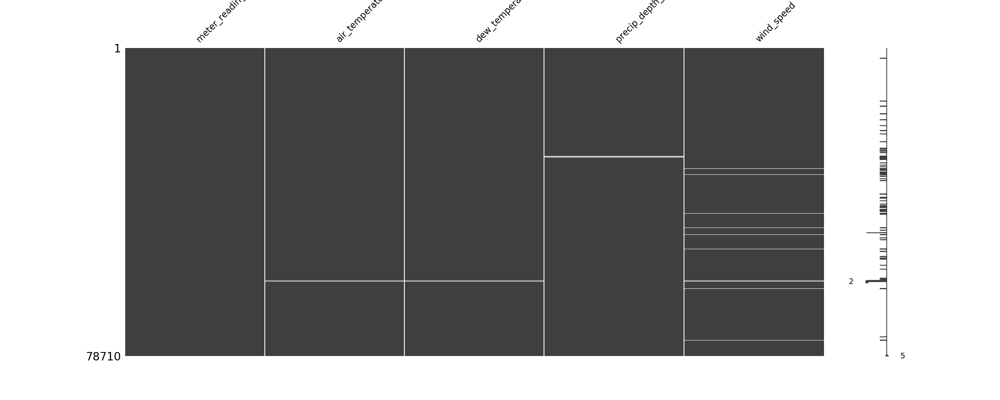
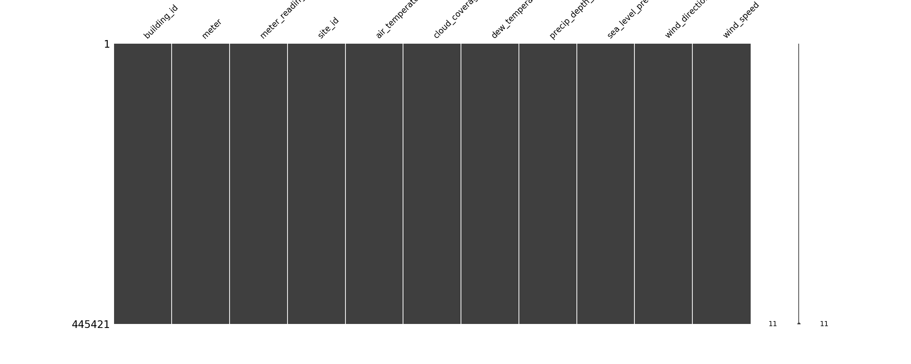

# Missing Values
## file config
[missing-values.yaml](../Config/missing-values.yaml)

## header functions

~~~
def missing_values(n_rows, fields_include, input_dir,elements,alg_missing)
~~~
## parameters
*   **n_rows:**         [ (int) ] Numbers rows DataSet. This params get from [main.yaml](main.yaml)
*   **elements:**       [ (string) name_elements ] Filter by elements. This params get from [main.yaml](main.yaml)
*   **fields_include:** [ (list string) name field DataSet ] Filter by DataSet fields.
*   **input_dir:**      [ (string) name directory ] Input directory to get data.
*   **alg_missing:**    [ (string) name_algorithms] Name Algorithms missing values. [interpolate, drop]

## explain use 
*   Config.yaml 

    ~~~
    main.yaml
        etl:      missing-values
        deepl:    ""
        mlearn:   ""
        n_rows:   0.0
        elements: ""
        output_dir: Data/test_icpe_v2

    missing-values.yaml
        fields_include: None
        input_dir: Data/test_icpe_v2
        alg_missing: interpolate
    ~~~

Throughs the parameters, the algorithms will take the csv files to apply remove missing-values techniques.The selected algorithm will be indicated in the alg_missing parameters. Currently only interpolation and row removal algorithms are implemented.

- interpolate:
~~~
   Generate interpolation values in both directions, up and down. 
~~~

- drop
~~~
    Remove complete lines if all values are Nan.
~~~

### Example Missing Values DataSet

### Then apply algorithm missing values.

## Return

Save dataSet without missing values in:.
`[input_dir]`

> :warning: **Overwrite previous csv**.

Save image png in:

 `[input_dir]/missing-values/[alg_missing]`

Save artifacts for show in mlfow ui:

 `mlflow.log_artifacts(input_dir+ "/missing-values")`