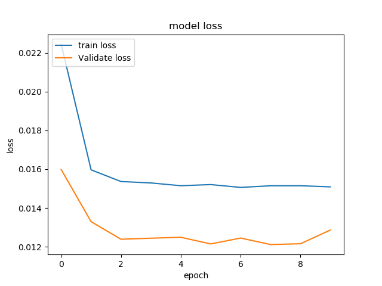

# MLP
## file config
[mlp.yaml](../Config/mlp.yaml)

## header functions

~~~
def mlp(file_analysis,artifact_uri,experiment_id, run_id, input_dir, model_input,model_output, n_rows,
n_steps,epochs,hidden_units,batch_size,verbose)
~~~
## parameters
*   **file_analysis:** File analyse. This param is generate from [main.py](../main.py)
*   **artifact_uri:** URL artifact mlflow. This param is generate from [main.py](../main.py)
*   **experiment_id:** Experiment id mlflow. This params is generate from [main.py](../main.py)
*   **run_id:** Run id mlflow. This param is generate from [main.py](../main.py)
*   **input_dir:** [ (string) name_directory ] Directory get Data.
*   **n_rows:** [ (int) ] Numbers rows DataSet. This params get from [main.yaml](main.yaml)
*   **model_input:** [ (list string) fields ] Fields input for run algorithms.
*   **model_output:** [ (list string) fields ] Fields output for run algorithms.
*   **n_splits:**  [ (int) ] Number trees
*   **n_steps:** [ (string) ] Params Split Sequences DataSet.
*   **epochs:** [ (string) ] Epochs Neuronal Network.
*   **hidden_units:** [ (string) ] Hidden Neuronals.
*   **batch_size:** [ (string) ] Batch Size every DataSet.
*   **verbose:** [ (string) ] Verbose algorithms.

## explain use

* Config.yaml

~~~
    main.yaml
        etl:      ""
        deepl:    mlp
        mlearn:   ""
        n_rows:   0.0
        elements: ""
        output_dir: Data/test_icpe_v2

    mlp.yaml
        model_input:                air_temperature,cloud_coverage,dew_temperature,precip_depth_1_hr,sea_level_pressure,meter_reading 
        model_output:               meter_reading 
        input_dir:                  Data/test_icpe_v2
        n_steps:                    2
        hidden_units:               50
        epochs:                     10
        batch_size:                 72                 1

~~~

This algorithm consists of a Multilayer Perceptron. The DataFrame used by the algorithm will be partitioned into three parts, one for the train, one for the test and one for the validation, currently set at 70,10,20 respectively. It should be noted that the values of the DataFrame will be previously normalized.  Then, the data will be sequenced, and the instervalos can be chopped up according to the n_steps. Once the data has been obtained, we make a model, using in this case a Perceptron network. We can adjust the values offered by the yaml file, being able to add some more if we wish. Finally we obtain the metrics that we are going to measure from our model as it is (rmse, mae,r2). The Perceptron Multilayer model will be stored, and a graph will be obtained showing the evolution of the model along the execution of the different periods. The model will be stored in the system with mlflow. 

### Return

Save image png:

`[input_dir]/mlp/[image.png]`

The metrics store are:
- rmse
- mae
- r2

~~~
    mlflow.log_metric("rmse", rmse)
    mlflow.log_metric("mae", mae)
    mlflow.log_metric("r2",r2)
~~~

Store models:
`mlflow.keras.log_model(keras_model=model,signature=signature,artifact_path=input_dir+"/mlp")`