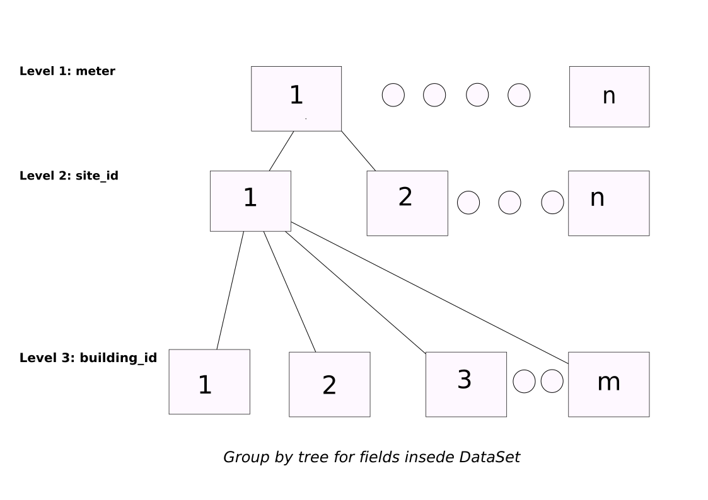

# PARTITION DATA
---
## file config

[partition-data.yaml](../Config/partition-data.yaml)

## header functions

~~~
def PartitionDF(date_init, date_end, path_data, n_rows,fields_include,group_by_parent, output_dir)
~~~
## parameters

*   **date_init:**[(string) Correct Date. App transform in datatime] Date init, in order to get data from DataSet. 
*   **date_end:** [(string) Correct Date. App transform in datatime] Date end, in order to get data from DataSet.
*   **path_data:** [(string) path ] Path origin DataSet.
*   **n_rows:** [ (int) ] Number rows DataSet.
*   **fields_include:** [ (list string) name field DataSet ] Filter by DataSet fields.
*   **group_by_parent:** [ (list string) name field DataSet] Goup by DataSet levels.
*   **output_dir:** [ ( string ) name directory  ] Ouput directory, to save data.

## explain use
*   Config.yaml 

    ~~~
    main.yaml
        etl:      partition-data
        deepl:    ""
        mlearn:   ""
        n_rows:   0.0
        elements: ""
        output_dir: Data/test_icpe_v2

    partition-data.yaml
        date_init: 2016-01-01 00:00:00
        date_end:  2016-12-31 00:00:00
        fields_include: None
        path_data: train.csv
        group_by_parent: meter,site_id
        output_dir: Data/test_icpe_v2
    ~~~

Selection date init  and date end in order to that the algorithms split origin dataset. If selection fields include split only realice with this fields selections. Path_data will be the path where get DataSet split. Group_by_parent is params very important, because,it groups the dataset in several levels.

In some cases, it need  split DataSet use any conditions, for example, meter, site_id ... With this option could group by DataSet and then split for this fields. Example: group_by_parent:meter,site_id,building, will create several DataSets where for each value of the parent, in this case meter, it will group them by site_id and later by building_id. 

In this case, it would be a grouping of three conditions to create the different DataSets.  For it, a tree is created, and through recursivity, it will build the different queries that later the system will do, to create the different CSV. To take into account, it is that the tree will be created from left to right, that is to say, the father would be 'meter', the children would be the unique values of site_id and the grandchildren, in this case, would be the unique values of building_id. It must be taken into account that the more values inserted in this field, the deeper the tree will be and the more computation it will need to obtain the solution.  

Finally the result will be save in the directory defined in the output_dir parameters.

### Return
-   The csv's obtained from the original DataSet partition. They will be saved in output_dir.
-   It will transform the csvs into html so that they can be consulted with the MLFlow user interface. 

