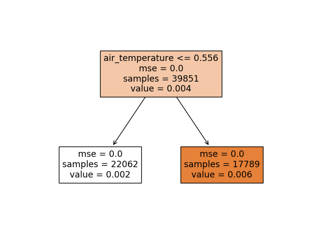

# RANDOM FOREST REGRESSION
---
## file config
[rf_regression.yaml](../Config/rf_regression.yaml)

## header functions

~~~
def RandomForest(file_analysis,artifact_uri,experiment_id, run_id, input_dir, model_input,model_output,n_rows, 
n_estimators,criterion,max_depth,min_samples_split, min_samples_leaf, min_weight_fraction_leaf,
max_features,max_leaf_nodes, min_impurity_decrease, bootstrap,oob_score, n_jobs,
random_state, verbose, warm_start, ccp_alpha, max_samples, figure,n_splits)
~~~
## parameters
*   **file_analysis:**              File analyse. This param is generate from [main.py](../main.py)
*   **artifact_uri:**               URL artifact mlflow. This param is generate from [main.py](../main.py)
*   **experiment_id:**              Experiment id mlflow. This params is generate from [main.py](../main.py)
*   **run_id:**                     Run id mlflow. This param is generate from [main.py](../main.py)
*   **input_dir:**                  [ (string) name_directory ] Directory get Data.
*   **n_rows:**                     [ (int) ] Numbers rows DataSet. This params get from [main.yaml](main.yaml)
*   **model_input:**                [ (list string) fields ] Fields input for run algorithms.
*   **model_output:**               [ (list string) fields ] Fields output for run algorithms.
*   **n_splits:**                   [ (int) ] Number trees
*   **n_estimators:**               [ (string) ] Params algorithms RandomForestRegressor
*   **criterion:**                  [ (string) ] Params algorithms RandomForestRegressor
*   **max_depth:**                  [ (string) ] Params algorithms RandomForestRegressor
*   **min_samples_split:**          [ (string) ] Params algorithms RandomForestRegressor
*   **min_samples_leaf:**           [ (string) ] Params algorithms RandomForestRegressor
*   **min_weight_fraction_leaf:**   [ (string) ] Params algorithms RandomForestRegressor
*   **max_features:**               [ (string) ] Params algorithms RandomForestRegressor
*   **max_leaf_nodes:**             [ (string) ] Params algorithms RandomForestRegressor
*   **min_impurity_decrease:**      [ (string) ] Params algorithms RandomForestRegressor
*   **bootstrap:**                  [ (string) ] Params algorithms RandomForestRegressor
*   **oob_score:**                  [ (string) ] Params algorithms RandomForestRegressor
*   **n_jobs:**                     [ (string) ] Params algorithms RandomForestRegressor
*   **random_state:**               [ (string) ] Params algorithms RandomForestRegressor
*   **verbose:**                    [ (string) ] Params algorithms RandomForestRegressor
*   **warm_start:**                 [ (string) ] Params algorithms RandomForestRegressor
*   **ccp_alpha:**                  [ (string) ] Params algorithms RandomForestRegressor
*   **max_samples:**                [ (string) ] Params algorithms RandomForestRegressor
*   **figure:**                     [ (string) ] Params algorithms RandomForestRegressor

## explain use

* Config.yaml

~~~
    main.yaml
        etl:      ""
        deepl:    ""
        mlearn:   rf_regression
        n_rows:   0.0
        elements: ""
        output_dir: Data/test_icpe_v2

    rf_regression.yaml
        model_input:              air_temperature,cloud_coverage,dew_temperature,precip_depth_1_hr,sea_level_pressure,wind_speed,meter_reading  
        model_output:             meter_reading 
        input_dir:                Data/test_icpe_v2
        n_estimators:             100
        criterion:                mse
        max_depth:                1
        min_samples_split:        2
        min_samples_leaf:         1
        min_weight_fraction_leaf: 0.0
        max_features:             auto
        max_leaf_nodes:           2
        min_impurity_decrease:    0.0
        bootstrap:                True
        oob_score:                False
        n_jobs:                   -1
        random_state:             0
        warm_start:               False
        ccp_alpha:                0.0
        max_samples:              None
        figure:                   False
        verbose:                  1
        n_splits:                 5

~~~
This algorithms perfoms through a numbers of Kfold a series  of models using RANDOM FOREST Regressor algorithms. It goes developing predictions and storing each one of the results in the array called **scores**.
**n_splits** will indicate us the number of times that the recived dataset will be split.  Finally, the metrics than  will be calculated are:

- Scores list every Kfold.
- mean
- Tipic desviations

Finally each model generated will be stored in mlflow.

### Return

Save image png:

`[input_dir]/rf_regression/[image.png]`

The metrics store are:
- Scores list every Kfold.
- mean
- Tipic desviations
~~~
    for idx in range(len(scores)):
            mlflow.log_metric("scores",scores[idx], step=idx+1 )
    mlflow.log_metric("mean", np.mean(scores))
    mlflow.log_metric("std", np.std(scores))
~~~
Store models:
`mlflow.sklearn.log_model(sk_model=rfr_model,signature=signature,artifact_path=input_dir+"/rf_regressor" )`

[ insert img mlflow ]

