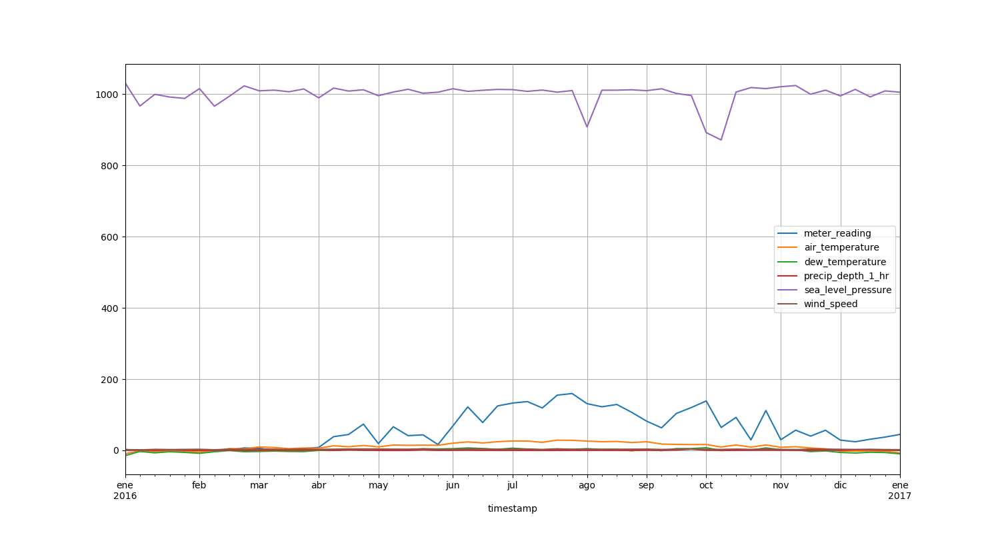
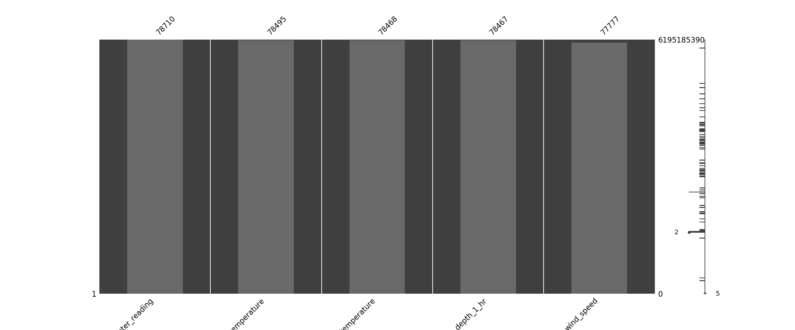
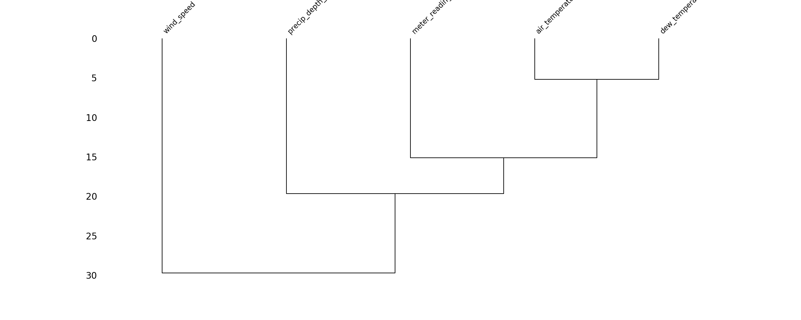
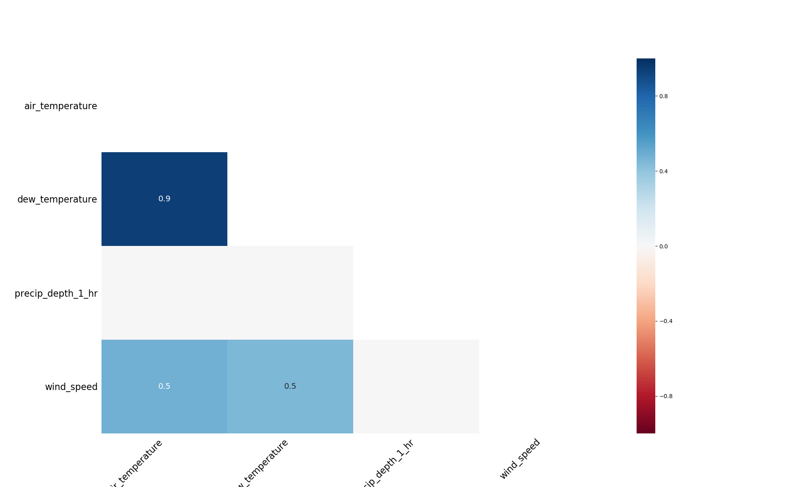

# Visualization
## file config
[visualization.yaml](../Config/visualization.yaml)

## header functions

~~~
def Visualization(n_rows,field_x, field_y, graph, measures, _resample, input_dir,elements)
~~~

## parameters
*   **n_rows:**     [ (int) ] Numbers rows DataSet. This params get from [main.yaml](main.yaml)
*   **elements:**   [ (string) name_elements ] Filter by elements. This params get from [main.yaml](main.yaml)
*   **field_x:**    [ (string) name_field] Field X graphs.Usually this timestamp.
*   **field_y:**    [ (string) name_field] Field Y graphs. 
*   **graph:**      [ (line | missing) ] Line Graphs timeseries or show missing values graph.
*   **measures:**   [ (list string) measures ] Determinate fields. Example: building_id,site_id
*   **resample:**   [  (string)  W, M, Y ] Resamples Week(W), Month(M), Y(Year). Only show data graph.
*   **input_dir:**  [ (string) name directory ] Input directory to get data.

## example

*   Config.yaml 

    ~~~
    main.yaml
        etl:      visualization
        deepl:    ""
        mlearn:   ""
        n_rows:   0.0
        elements: ""
        output_dir: Data/test_icpe_v2

    visualization.yaml
        field_x:    timestamp
        field_y:    site_id
        graph:      line
        _resample:  W
        measures:   meter_reading,air_temperature,dew_temperature,precip_depth_1_hr,sea_level_pressure,wind_speed
        input_dir:  Data/test_icpe_v2

    ~~~

`mlflow run . --experiment-name="test visualization"`

The images generate for app, save inside folder Data/[input_dir]/visualization/
- line:
    -   line graph

This module will help us to display the values of the selected fields with the measure parameter. If measure == None it will show all DataSet fields, if on the contrary, we indicate fields, those will be shown. In the visual example, it shows us the fields meter_reading, air_temperature, dew_temperature, precip_depth_1_hr, sea_level_pressure,wind_speed.

- missing values:
    -   bar
    -   dendogram
    -   matrix
   

This module will help us to watch the fields than content missing values and behaviour distinct fields thought time series.

### Line

### Bar

### Dendogram

### HeatMap

### Matrix

## Return

Visualization DataSet. 

Save image png in:

 `[input_dir]/visualization/[line,bar,dendogram,matrix,heatmap]/train_[group_by_level].csv`

Save artifacts for show in mlfow ui:

 `mlflow.log_artifacts(input_dir+ "/visualization")`