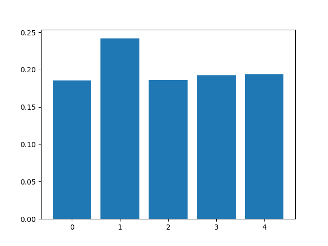

# XGBOOST
## file config
[xgb.yaml](../Config/xgb.yaml)

## header functions

~~~
def xgboost(file_analysis,artifact_uri,experiment_id, run_id, input_dir,n_rows,
model_input,model_output,n_splits, objective )
~~~
## parameters
*   **file_analysis:** File analyse. This param is generate from [main.py](../main.py)
*   **artifact_uri:** URL artifact mlflow. This param is generate from [main.py](../main.py)
*   **experiment_id:** Experiment id mlflow. This params is generate from [main.py](../main.py)
*   **run_id:** Run id mlflow. This param is generate from [main.py](../main.py)
*   **input_dir:** [ (string) name_directory ] Directory get Data.
*   **n_rows:** [ (int) ] Numbers rows DataSet. This params get from [main.yaml](main.yaml)
*   **model_input:** [ (list string) fields ] Fields input for run algorithms.
*   **model_output:** [ (list string) fields ] Fields output for run algorithms.
*   **n_splits:**  [ (int) ] Number trees
*   **objective:** [ (string) ] Params algorithms XGBRegressor

## explain use

* Config.yaml

~~~
    main.yaml
        etl:      ""
        deepl:    ""
        mlearn:   xgb
        n_rows:   0.0
        elements: ""
        output_dir: Data/test_icpe_v2

    xgb.yaml
        model_input:    air_temperature,cloud_coverage,dew_temperature,precip_depth_1_hr,sea_level_pressure,meter_reading
        model_output:   meter_reading 
        n_splits:       5
        objective:      reg:squarederror
        input_dir:      Data/test_icpe_v2

~~~
This algorithms perfoms through a numbers of Kfold a series  of models using XGBOOST Regressor algorithms. It goes developing predictions and storing each one of the results in the array called **scores**.
**n_splits** will indicate us the number of times that the recived dataset will be split.  Finally, the metrics than  will be calculated are:

- Scores list every Kfold.
- mean
- Tipic desviations

Finally each model generated will be stored in mlflow.

## Return
Image png:

`[input_dir]/xgboost/[csv]`

The metrics store are:
- Scores list every Kfold.
- mean
- Tipic desviations
~~~
    for idx in range(len(scores)):
            mlflow.log_metric("scores",scores[idx], step=idx+1 )
    mlflow.log_metric("mean", np.mean(scores))
    mlflow.log_metric("std", np.std(scores))
~~~
Store models:
`mlflow.xgboost.log_model(xgb_model=xgb_model,signature=signature,artifact_path=input_dir+"/xgboost" )`

[ insert img mlflow ]
